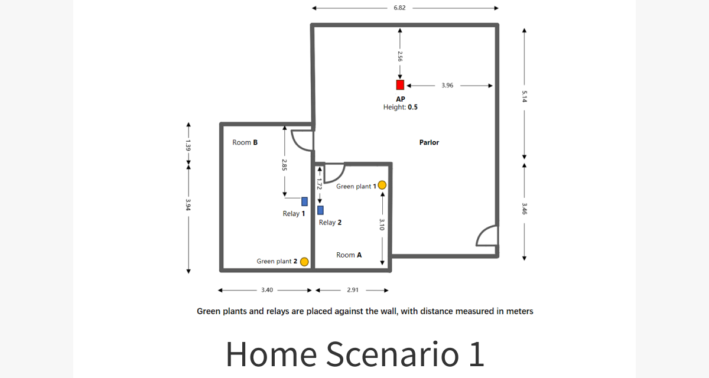

# 基于Transformer的WiFi人体存在检测

本项目使用基于Transformer的深度学习模型，通过WiFi信道状态信息（CSI）数据来检测多个房间内的人体存在并统计人数。

## 项目概览

本项目的目标是根据从两个WiFi接收器收集的CSI数据，判断三个不同房间（A房间、B房间和一个客厅）中的人数。模型采用一个Transformer编码器处理CSI数据序列，并对每个房间进行预测。该问题被视为一个多任务分类问题。
以Home Scenario1为例，如下图所示：


Parlor中的红色的AP代表信号TX，Room A/B 中的两个蓝色的Relay 1/2代表信号中继站,最终的目的是通过两个中继站发回AP的信号数据取判断三个房间内的具体人数。

## 文件结构

```
.
├── config.yaml                 # 项目配置文件
├── datasets/                   # 数据集目录
│   └── datasets_instruction.md # 数据集详细说明
├── env/
│   ├── environment.yml         # Conda环境定义
│   └── setup_env.sh            # 设置Conda环境的脚本
├── model/                      # 存放训练好的模型检查点
├── result/
│   ├── ...                     # 推理结果
│   └── visualization/
│       └── ...                 # 结果的可视化（如混淆矩阵）
├── training/
│   └── ...                     # 训练过程中的日志和可视化
├── script/
│   ├── start_training.sh       # 启动训练过程的脚本
│   └── start_inference.sh      # 启动推理过程的脚本
├── src/
│   ├── train.py                # 主要训练脚本
│   ├── model.py                # Transformer模型定义
│   ├── utils.py                # 数据加载和工具函数
│   ├── losses.py               # 自定义损失函数
│   └── inference.py            # 用于运行推理的脚本
└── README.md                   # 本文件
```

## 环境要求

- **操作系统:** Linux
- **GPU:** 支持CUDA的NVIDIA GPU
- **CUDA版本:** 推荐12.1或更高版本
- **Conda:** 需要安装Anaconda或Miniconda

## 安装与配置

1.  **克隆仓库:**
    ```bash
    git clone https://github.com/cenzihan/I3C_WiFi_Sensing_Contest_Home_Scenario.git 
    cd I3C_WiFi_Sensing_Contest_Home_Scenario
    ```

2.  **为脚本添加可执行权限:**
    为了方便后续操作，建议首先为项目中的主要脚本添加可执行权限。
    ```bash
    chmod +x env/setup_env.sh script/start_training.sh script/start_inference.sh
    ```

3.  **创建Conda环境:**
    运行 `setup_env.sh` 脚本来为本项目创建和配置Conda环境。
    ```bash
    ./env/setup_env.sh
    ```
    这将创建一个名为 `wifi_sensing` 的Conda环境。

4.  **激活环境:**
    在运行任何脚本之前，请激活新创建的环境：
    ```bash
    conda activate wifi_sensing
    ```

5.  **解压dataset**
    解压datasets/目录下的数据集压缩包，并将其解压到datasets/目录下。
    ```bash
    unzip datasets/home_scenario.zip -d datasets/
    ```

6.  **配置参数:**
    根据需要在 `config.yaml` 文件中调整参数。该文件控制数据路径、模型超参数和训练设置。

## 如何运行

### 训练

要开始训练过程，请运行 `start_training.sh` 脚本。该脚本会使用 `config.yaml` 中定义的配置在单个GPU上开始训练。

```bash
./script/start_training.sh
```

训练好的模型将保存在 `model/` 目录中。

### 推理

要对训练好的模型进行推理，我们提供了一个便捷的脚本。请确保 `config.yaml` 中的 `model_path` 指向所需的模型检查点，然后运行：

```bash
./script/start_inference.sh
```

该脚本会自动读取配置文件，并显示正在使用的模型路径。推理过程中会显示一个进度条。

包括分类准确率和混淆矩阵在内的结果将保存在 `result/` 目录中。

## 数据集

本项目的大部分数据集并未包含在Git仓库中。请从[这里](<http://www.sdp8.org/Dataset?id=787a9a88-d2f3-4944-a174-8edf6070c99a>)下载数据集压缩包，并将其解压到项目的datasets/目录下。

解压后，请确保你的文件结构如下所示：

```
.
├── datasets/
│   ├─home scenario_1
│   │  ├─data
│   │  │  ├─room_A
│   │  │  └─room_B
│   │  └─truth
│   │     ├─room_A
│   │     ├─room_B
│   │     └─parlor
│   ├─home scenario_2
│   │  ├─data
│   │  │  ├─room_A
│   │  │  └─room_B
│   │  └─truth
│   │     ├─room_A
│   │     ├─room_B
│   │     └─parlor 
├── src/
└── ...
```

关于数据集的结构、格式和采集场景的深入分析，请参阅 `datasets/datasets_instruction.md` 文件。

